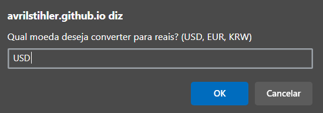
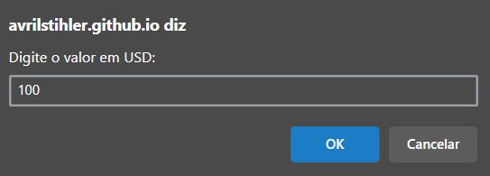
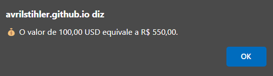

# 💱 Conversor de Moedas para Reais

Uma aplicação simples feita em **JavaScript**, que permite converter valores de **USD (dólar americano)**, **EUR (euro)** ou **KRW (won sul-coreano)** para **reais (BRL)**, utilizando `prompt()` e `alert()` para interação com o usuário.

Clique [aqui](https://avrilstihler.github.io/Conversor-de-Moeda/) para acessar o conversor.

## 🚀 Como funciona

A função `conversor()` executa o processo de conversão de forma simples e direta:

### 🧾 Passos:

1. O usuário escolhe uma das moedas disponíveis: `USD`, `EUR` ou `KRW`.
2. Insere o valor que deseja converter.
3. O sistema verifica se os dados estão corretos (moeda válida, valor numérico, etc.).
4. O valor é convertido para reais com base em uma **taxa de câmbio fixa**.
5. O resultado é exibido em um alerta, já formatado no padrão brasileiro.

## 💹 Taxas de câmbio utilizadas

| Moeda | Descrição          | Taxa de Conversão    |
|-------|--------------------|----------------------|
| USD   | Dólar Americano    | 1 USD = R$ 5,50      |
| EUR   | Euro               | 1 EUR = R$ 6,00      |
| KRW   | Won Sul-Coreano    | 1 KRW = R$ 0,0039    |

## 📦 Tecnologias utilizadas

- JavaScript, Html e CSS
- `prompt()` e `alert()` para interação com o usuário
- `parseFloat()` e `replace()` para tratamento de entrada
- `toLocaleString()` para formatação de valores em reais

## 🧠 Aprendizados

Este projeto é ideal para quem está começando no JavaScript e deseja praticar:

- Estrutura de funções
- Condicionais (`if`)
- Manipulação de strings e números
- Validação de dados do usuário

## ✅ Exemplo de uso

| 💰 Escolha da Moeda | 📋 Valor de entrada |
|---|---|
|  |  |

| 💵 Valor Convertido |
|---|
|  |

